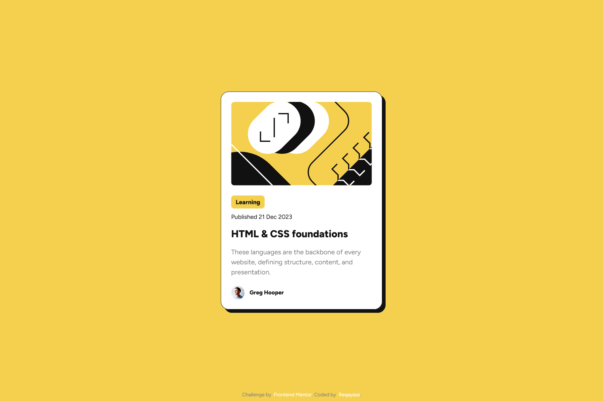

# Frontend Mentor - Blog preview card solution

This is a solution to the [Blog preview card challenge on Frontend Mentor](https://www.frontendmentor.io/challenges/blog-preview-card-ckPaj01IcS). Frontend Mentor challenges help you improve your coding skills by building realistic projects. 

## Overview

### The challenge

Users should be able to:

- See hover and focus states for all interactive elements on the page

### Screenshot

### Links

- Solution URL: [Github Pages](https://reqayasa.github.io/fmr-blog-preview-card/)
- Live Site URL: [Github](https://github.com/reqayasa/fmr-blog-preview-card)

## My process

### Built with

- Semantic HTML5 markup
- CSS custom properties
- Flexbox
- Mobile-first workflow
- [Vite](https://vitejs.dev/) - Vite for Build Tools

## Author

- Frontend Mentor - [@reqayasa](https://www.frontendmentor.io/profile/reqayasa)
